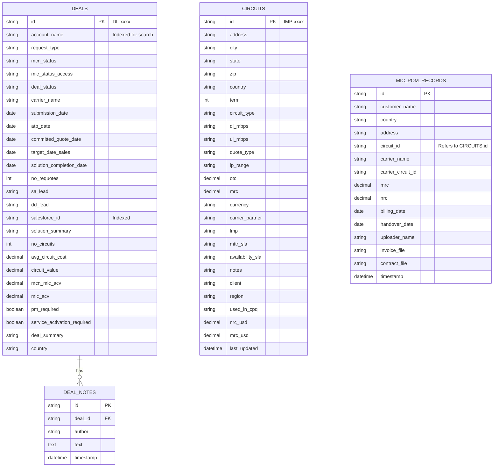

# Database Schema Design for Azure Database for PostgreSQL (Flexible Server)

This document outlines the database schema required to support the application's functionality, including Deals Management, Circuit Inventory, and MIC POM (Project Order Management).

## 1. Entity Relationship Diagram (ERD)



## 2. Table Definitions & SQL Commands

Run the following SQL commands in your Azure Database for PostgreSQL query tool (like pgAdmin or Azure Data Studio) to create the necessary tables.

### 2.1 Deals Table

Stores all deal opportunity records.

```sql
CREATE TABLE deals (
    id VARCHAR(50) PRIMARY KEY,
    account_name VARCHAR(255) NOT NULL,
    request_type VARCHAR(100),
    mcn_status VARCHAR(50),
    mic_status_access VARCHAR(50),
    deal_status VARCHAR(50),
    carrier_name VARCHAR(255),
    submission_date DATE,
    atp_date DATE,
    committed_quote_date DATE,
    target_date_sales DATE,
    solution_completion_date DATE,
    no_requotes INT DEFAULT 0,
    sa_lead VARCHAR(255),
    dd_lead VARCHAR(255),
    salesforce_id VARCHAR(100),
    solution_summary TEXT,
    no_circuits INT DEFAULT 0,
    avg_circuit_cost DECIMAL(15, 2),
    circuit_value DECIMAL(15, 2),
    mcn_mic_acv DECIMAL(15, 2),
    mic_acv DECIMAL(15, 2),
    pm_required BOOLEAN DEFAULT FALSE,
    service_activation_required BOOLEAN DEFAULT FALSE,
    deal_summary TEXT,
    country VARCHAR(100)
);

CREATE INDEX idx_account_name ON deals (account_name);
CREATE INDEX idx_salesforce_id ON deals (salesforce_id);
CREATE INDEX idx_deal_status ON deals (deal_status);
```

### 2.2 Deal Notes Table

Stores comments and history logs associated with deals.

```sql
CREATE TABLE deal_notes (
    id VARCHAR(50) PRIMARY KEY,
    deal_id VARCHAR(50) NOT NULL REFERENCES deals(id) ON DELETE CASCADE,
    author VARCHAR(255),
    note_text TEXT,
    created_at TIMESTAMP DEFAULT CURRENT_TIMESTAMP
);
```

### 2.3 Circuits Table

Stores the inventory of all circuits.

```sql
CREATE TABLE circuits (
    id VARCHAR(50) PRIMARY KEY,
    address TEXT,
    city VARCHAR(100),
    state VARCHAR(100),
    zip VARCHAR(50),
    country VARCHAR(100),
    term INT,
    circuit_type VARCHAR(100),
    dl_mbps VARCHAR(50),
    ul_mbps VARCHAR(50),
    quote_type VARCHAR(100),
    ip_range VARCHAR(50),
    otc DECIMAL(15, 2),
    mrc DECIMAL(15, 2),
    currency VARCHAR(10),
    carrier_partner VARCHAR(255),
    lmp VARCHAR(255),
    mttr_sla VARCHAR(100),
    availability_sla VARCHAR(100),
    notes TEXT,
    client VARCHAR(255),
    region VARCHAR(100),
    used_in_cpq VARCHAR(100),
    nrc_usd DECIMAL(15, 2),
    mrc_usd DECIMAL(15, 2),
    last_updated TIMESTAMP DEFAULT CURRENT_TIMESTAMP
);

CREATE INDEX idx_circuit_client ON circuits (client);
CREATE INDEX idx_circuit_country ON circuits (country);
```

### 2.4 MIC POM Records Table

Stores project order management records, including file references for invoices and contracts.

```sql
CREATE TABLE mic_pom_records (
    id VARCHAR(50) PRIMARY KEY,
    customer_name VARCHAR(255),
    country VARCHAR(100),
    address TEXT,
    circuit_id VARCHAR(50),
    carrier_name VARCHAR(255),
    carrier_circuit_id VARCHAR(100),
    mrc DECIMAL(15, 2),
    nrc DECIMAL(15, 2),
    billing_date DATE,
    handover_date DATE,
    uploader_name VARCHAR(255),
    invoice_file VARCHAR(255),
    contract_file VARCHAR(255),
    timestamp TIMESTAMP DEFAULT CURRENT_TIMESTAMP
);

CREATE INDEX idx_pom_customer ON mic_pom_records (customer_name);
CREATE INDEX idx_pom_circuit_id ON mic_pom_records (circuit_id);
```


### 2.5 Users and Permissions

```sql
CREATE TABLE users (
    id SERIAL PRIMARY KEY,
    username VARCHAR(100) NOT NULL UNIQUE,
    email VARCHAR(255) NOT NULL UNIQUE,
    password_hash VARCHAR(255) NOT NULL,
    role VARCHAR(50) DEFAULT 'user',
    created_at TIMESTAMP DEFAULT CURRENT_TIMESTAMP
);

CREATE TABLE permissions (
    id SERIAL PRIMARY KEY,
    user_id INT REFERENCES users(id) ON DELETE CASCADE,
    resource VARCHAR(50) NOT NULL, -- e.g., 'DASBOARD', 'DEALS', 'CIRCUIT_INVENTORY'
    access_level VARCHAR(20) NOT NULL, -- 'VIEW', 'EDIT'
    UNIQUE(user_id, resource)
);
```


### 2.6 Matrix Scan History

Stores historical results of matrix comparisons.

```sql
CREATE TABLE scan_sessions (
    id VARCHAR(50) PRIMARY KEY,
    scan_name VARCHAR(255),
    created_at TIMESTAMP DEFAULT CURRENT_TIMESTAMP,
    total_sites INT,
    total_mrc DECIMAL(15, 2)
);

CREATE TABLE scan_results (
    id VARCHAR(50) PRIMARY KEY,
    session_id VARCHAR(50) REFERENCES scan_sessions(id) ON DELETE CASCADE,
    client_site_id VARCHAR(255),
    address TEXT,
    city VARCHAR(100),
    country VARCHAR(100),
    winning_carrier VARCHAR(255),
    winning_mrc DECIMAL(15, 2),
    winning_nrc DECIMAL(15, 2),
    currency VARCHAR(10),
    term INT
);
```
